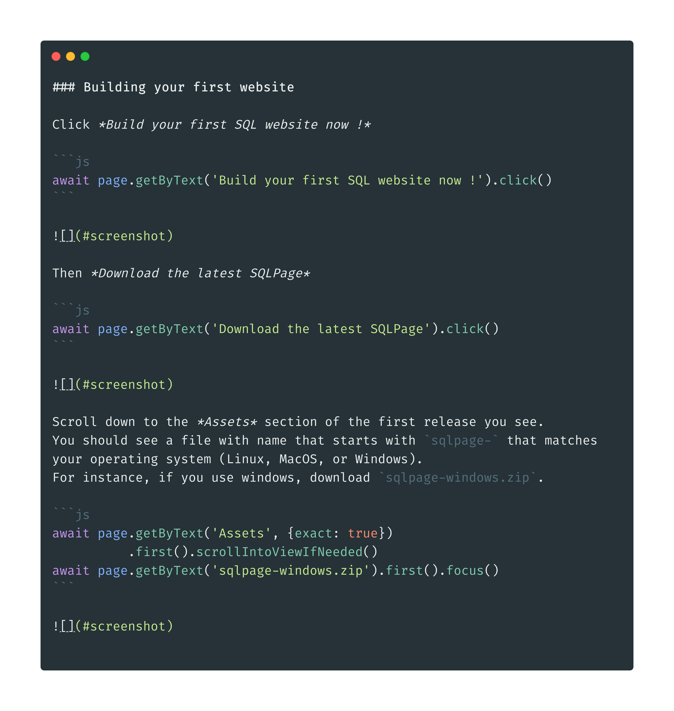
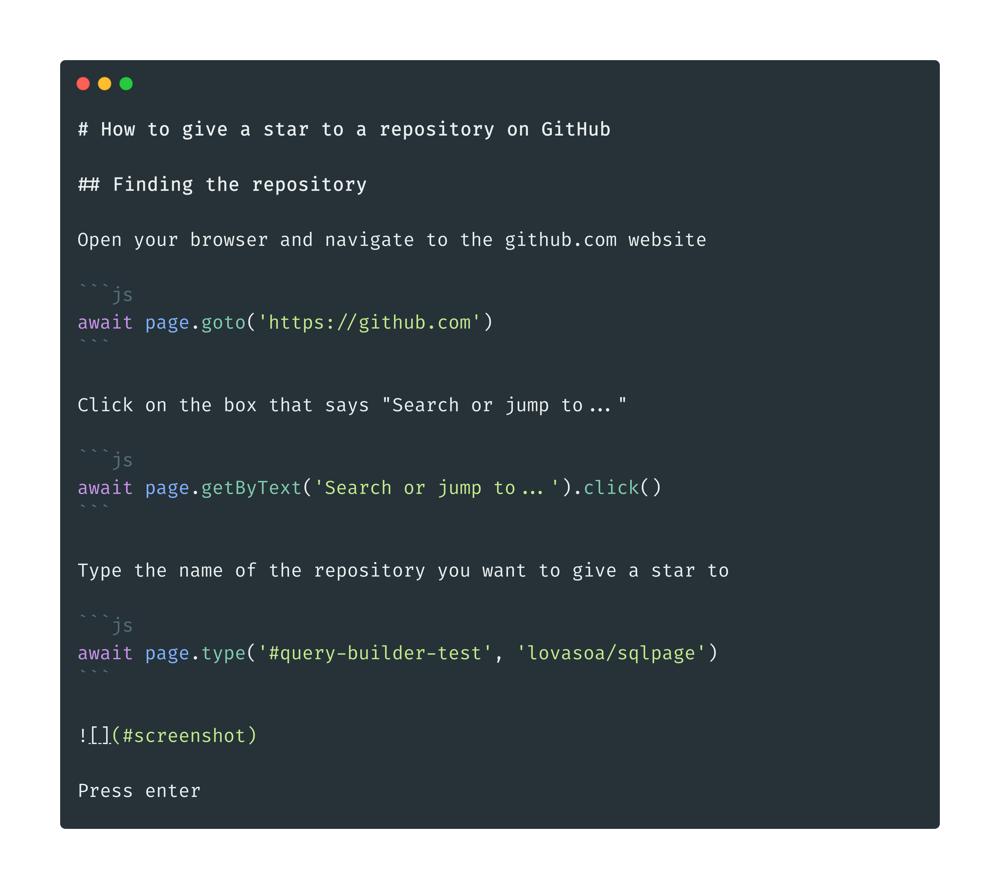
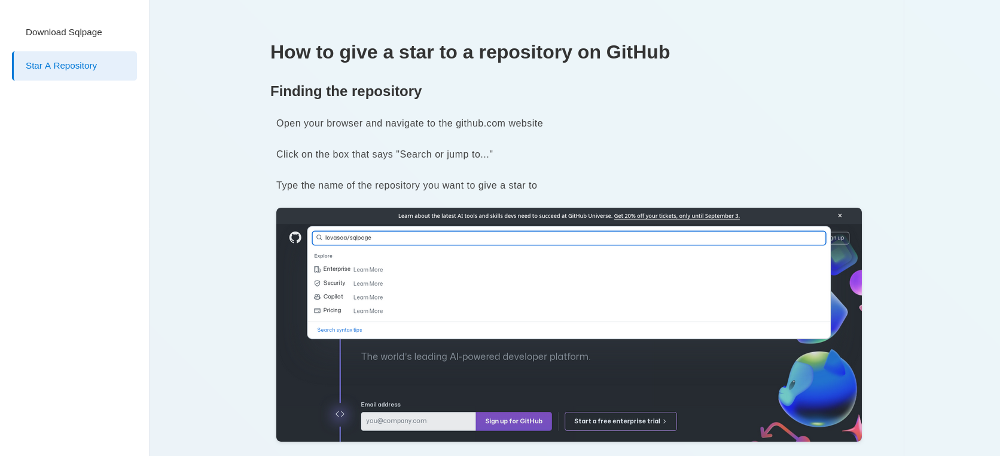
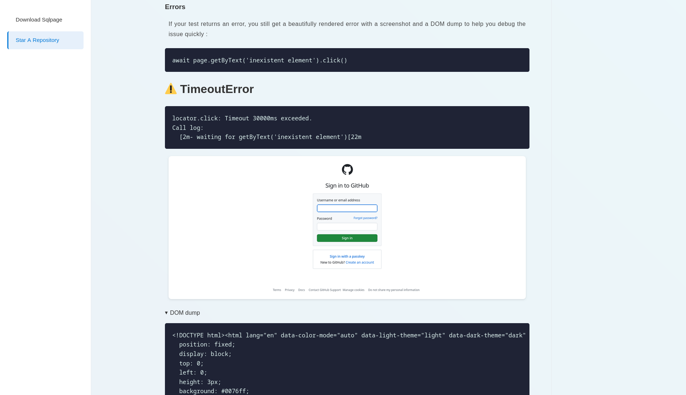

# DocuRun

<center>  </center>

DocuRun is a tool to run your documentation as integration tests.

## Why ?

I bet both your **integration tests** and your **documentation** are both disappointing.

 - Your integration tests are probably hard to write, hard to read, and hard to debug.
   When something goes wrong, you have to dig through the code and try to guess at which point they differ from what you are doing manually in your browser.
 - Your end user documentation is probably out of date, because the developers don't want to update it every time they change the code.
   When you change the wording of a button, you have to remember to go update the screenshots in the documentation, and you probably won't.

If you make a change that breaks the documented behavior of the user interface, you probably only find out when your users complain.

## What is DocuRun ?

DocuRun is a tool that takes markdown files including [playwright](https://playwright.dev/) code blocks and runs them as integration tests.
It produces a beautiful documentation website with screenshots taken during the tests.

## How to use DocuRun

1. Write your documentation in markdown files, including code blocks that describe how to use your application.
   Create a [`docurun/index.md`](./docurun/download_sqlpage.md) file that looks like this: 
2. Run DocuRun on your markdown files
    ```bash
    npx docurun
    ```
3. Docurun will display a nice report on its standard output showing which markdown files ran successfully and which failed.
   The exit code will be 0 if all tests passed, and 1 if some tests failed, which makes it easy to integrate in your CI/CD pipeline.
   It will also create a `docurun/website/` directory containing a static website with your documentation and screenshots.
   If some tests failed, the documentation will contain the screenshots of the page at the time of the failure, and the error message.

### Docker

You can also run DocuRun in a docker container, without having to install node.js on your machin:

```bash
docker run -v $(pwd)/docurun:/docurun -it lovasoa/docurun
```

See [lovaoa/docurun](https://hub.docker.com/r/lovasoa/docurun) on Docker Hub.

## Screenshots

### SQLPage

This shows the executable documentation of the [SQLPage](https://sql.ophir.dev/) website building tool.


### Github stars



### Errors

An error run looks like this in the terminal

```
$ npx docurun

> docurun@0.0.1 start
> node cli.js

Processing all files in ./docurun/:
 - download_sqlpage.md
 - star_a_repository.md.
Saving results to ./docurun/website/.

✅ download_sqlpage
Error while executing code:
await page.getByText('inexistent element').click()

locator.click: Timeout 30000ms exceeded.
Call log:
  - waiting for getByText('inexistent element')

❌ star_a_repository
```

And rendered:


